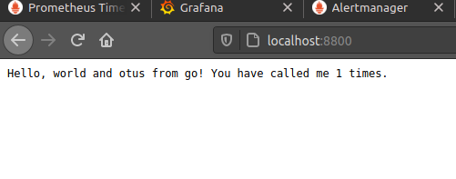

# Go HTTP Hello World

A simple HTTP "Hello World" server in Go.

## Usage

### Locally

Just run the following to clone, build, and start the server.

```shell
git clone https://github.com/geetarista/go-http-hello-world.git
cd go-http-hello-world/hello_world
go build hello_world.go
./hello_world
```

Then just curl the path and you'll see the message. You can visit it multiple times and increment the count.

```shell
curl http://localhost/
```

If the server immediately stops, you might need to change the `port` constant in [hello_world.go](https://raw.github.com/geetarista/go-http-hello-world/master/hello_world/hello_world.go).


## License

MIT. See `LICENSE`

Запустим проект согласно инструкции автора и зайдем на http://127.0.0.1:8800/ :


